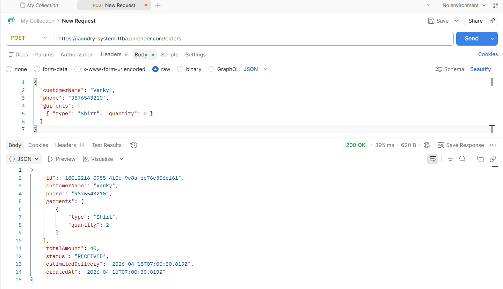
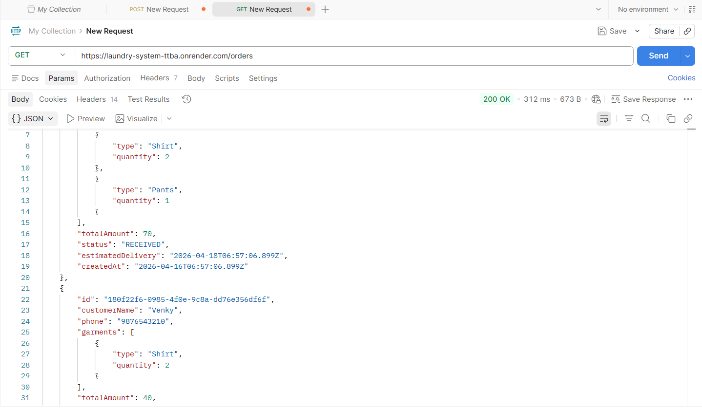
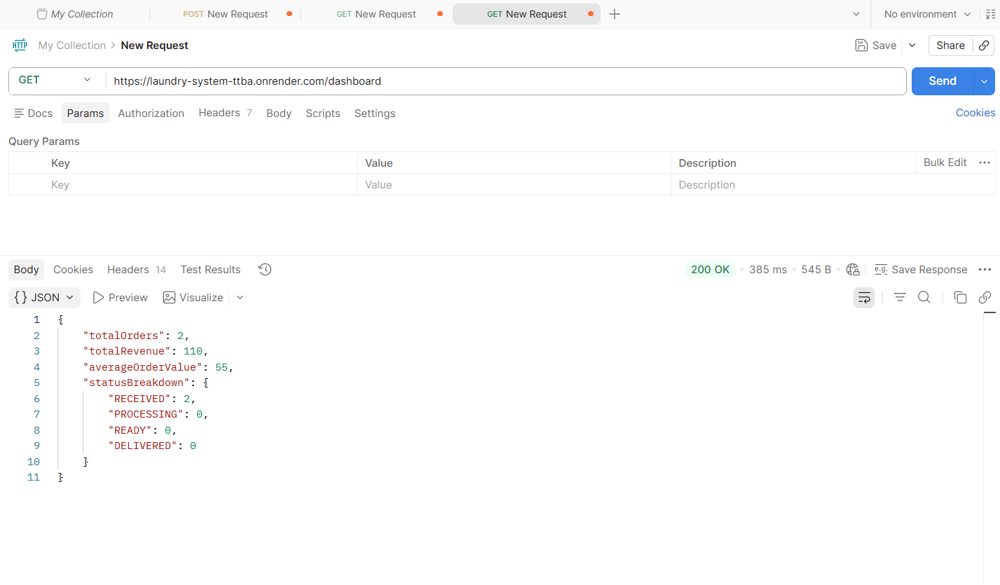

# 🧺 Laundry Order Management System (AI-First)

## 🚀 Live Demo
🔗 https://laundry-system-ttba.onrender.com

---
## 📌 Overview
This project is a lightweight Laundry Order Management System designed to manage daily dry-cleaning operations. It allows users to create orders, track order status, calculate billing, and view dashboard analytics.

---

## ⚙️ Setup Instructions

1. Install dependencies:
npm install

2. Run the server:
node index.js

Server runs at:
http://localhost:3000

---

## ✨ Features Implemented

### 🧾 Order Management
- Create orders with customer details
- Add garments with quantity
- Automatic total bill calculation
- Unique Order ID generation

### 🔄 Order Status Management
Each order supports:
- RECEIVED
- PROCESSING
- READY
- DELIVERED

### 🔍 Filtering
- Filter orders by status
- Search by customer name
- Search by phone number

### 📊 Dashboard
- Total orders
- Total revenue
- Orders per status
- Average order value

### ⭐ Extra Features
- Estimated delivery date (+2 days)

---

## 🧠 AI Usage Report

### 🔹 Tools Used
- ChatGPT
- GitHub Copilot (optional)

---

### 🔹 Sample Prompts
- "Create a Node.js Express API for a laundry order system"
- "Write a function to calculate total bill from garments array"
- "Add filtering logic to API based on query parameters"
- "Generate dashboard statistics from orders data"

---

### 🔹 Where AI Helped
- Generated initial Express server structure
- Helped implement business logic (billing, filtering)
- Suggested API design and endpoints

---

### 🔹 Where AI Was Incorrect
- Missing input validation
- Basic error handling
- Needed refinement in filtering logic

---

### 🔹 Improvements Made
- Added validation for required fields
- Fixed filtering logic
- Added delivery date feature
- Improved code structure and readability

---

## ⚖️ Tradeoffs

- Used in-memory storage instead of database for simplicity
- No authentication system implemented
- Focused on backend APIs over UI

---

## 📡 API Endpoints

| Method | Endpoint | Description |
|--------|--------|-------------|
| POST | /orders | Create order |
| GET | /orders | Get all orders |
| PUT | /orders/:id/status | Update status |
| GET | /dashboard | Dashboard data |

---

## 🏆 Future Improvements

- Add MongoDB database
- Build full frontend UI
- Add authentication system
- Improve UI/UX
- 
## 📸 Screenshots

### Create Order

### View Orders

### Dashboard

### Live App

